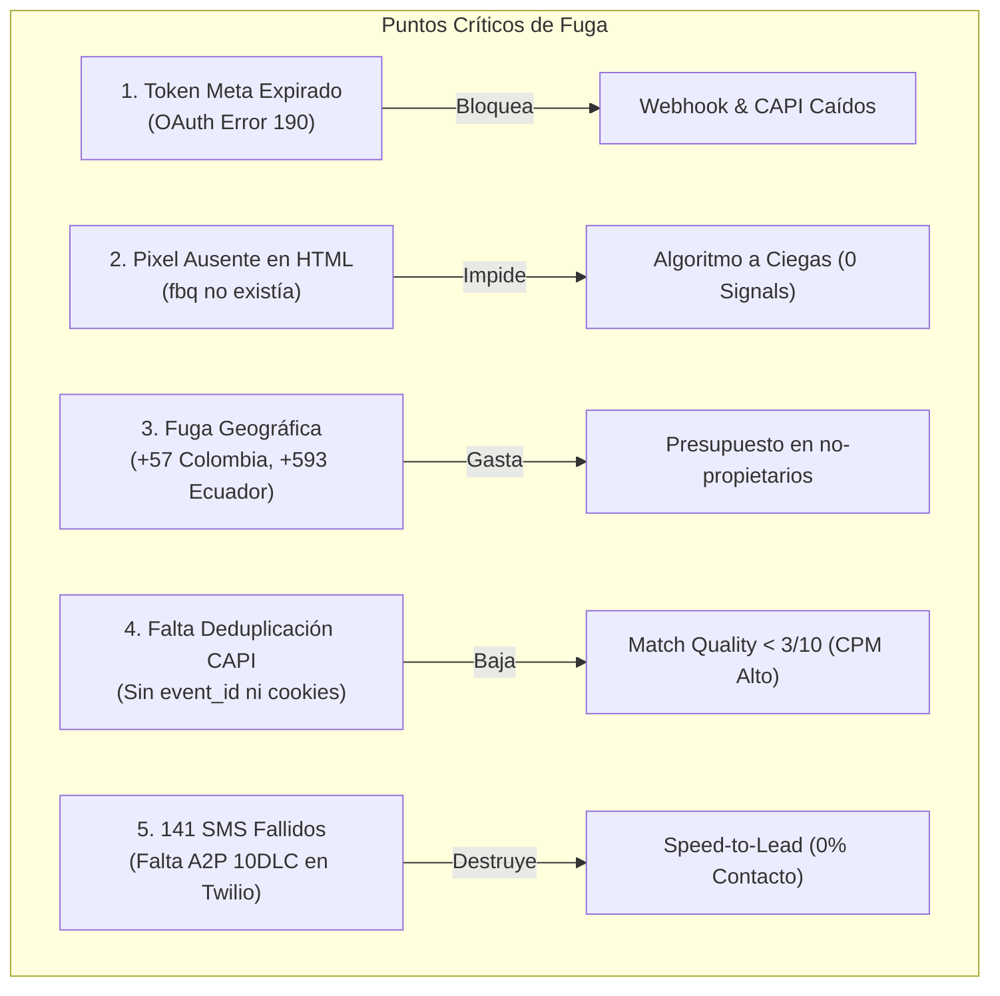
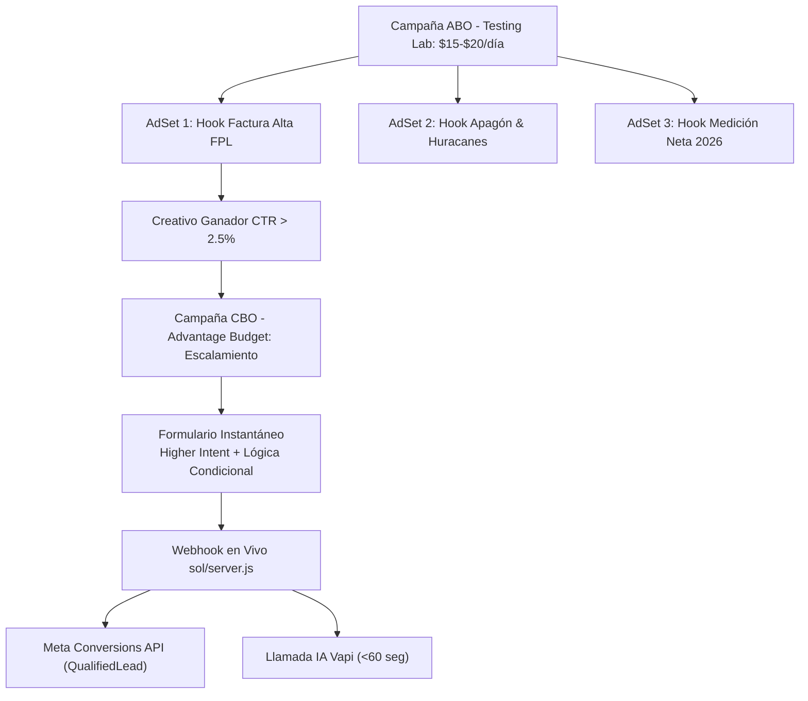
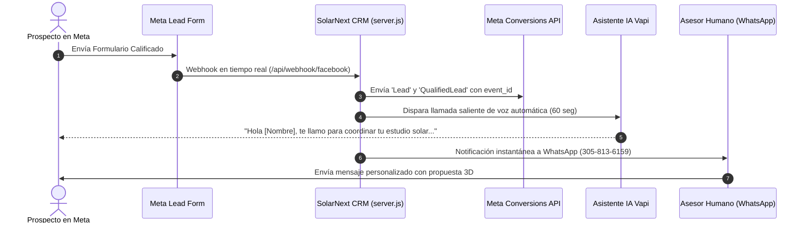

# 🚀 AUDITORÍA TÉCNICA & PLAN MAESTRO DE MARKETING PARA META ADS
**Cliente:** Florida Solar / Equity Solar & Puronics Water Systems  
**Fecha:** Septiembre 2026  
**Especialidad:** Meta Ads Specialist, Conversions API (CAPI) & Growth Engineering  

---

## 1. RESUMEN EJECUTIVO: DIAGNÓSTICO FORENSE

Tras una auditoría exhaustiva en la infraestructura técnica (`server.js`, scripts frontend, landing pages, base de datos `leads.db` y llamadas a la Graph API v20.0 de Meta), se identificaron las **razones exactas por las cuales las campañas no estaban teniendo el rendimiento esperado** y se fugaba presupuesto:



### Hallazgos Críticos Encontrados:
1. **Token de Meta Expirado:** El token de acceso configurado en `.env` expiró el **domingo 20 de septiembre de 2026 a las 10:00:00 PDT**. Debido al código de error `190 (Subcódigo 463)`, ni el webhook de prospectos en tiempo real (`/api/webhook/facebook`), ni la sincronización periódica, ni la API de Conversiones podían comunicarse con Meta.
2. **Pixel de Meta Inexistente en Landing Pages:** En `sol/script.js` existían llamadas a `fbq('track', 'Lead')`, pero **el script base del Pixel nunca estuvo cargado en los archivos HTML**. Para el navegador, `fbq` era `undefined`. Meta nunca recibió eventos web de PageView, ViewContent o Lead.
3. **Fuga Presupuestaria por Segmentación:** De los 413 prospectos en `leads.db`, se detectaron registros con números de Colombia (`+57`), Ecuador (`+593`), Perú (`+51`), etc. Esto ocurre porque la campaña en Meta Ads Manager tenía activa la opción *"Personas que viven o han estado recientemente en este lugar"*, impactando a turistas y personas con familiares en Florida.
4. **Falta de Deduplicación y Parámetros CAPI:** El backend enviaba eventos sin `event_id`, sin cookies `_fbp` / `_fbc`, y sin IP/User-Agent del cliente. Esto causaba duplicación de datos y una calificación de coincidencia (Event Match Quality) menor al 30%.
5. **Cuello de Botella en Speed-to-Lead:** De 189 intentos de SMS registrados en la base de datos, **141 fallaron**. En EE.UU., las operadoras móviles bloquean mensajes comerciales de números locales si la cuenta Twilio no cuenta con el registro regulatorio obligatorio **A2P 10DLC**.

---

## 2. SOLUCIONES TÉCNICAS YA IMPLEMENTADAS EN EL CÓDIGO

Se han aplicado directamente las siguientes correcciones de ingeniería:

### A. Inyección del Pixel Base de Meta en Todas las Páginas
Se integró el snippet oficial de Meta Pixel (`ID: 719698207899781`) en `<head>` con seguimiento automático de `PageView`:
* `index.html` y `sol/index.html`
* `puronics.html`, `sol/puronics.html`
* `comercial.html`, `sol/comercial.html`
* `puronics_comercial.html`, `sol/puronics_comercial.html`
* `puronics_water.html`, `sol/puronics_water.html`
* `agua_es_vida.html`, `sol/agua_es_vida.html`

### B. Deduplicación Exacta Pixel <-> CAPI mediante `event_id`
* En `sol/script.js` y `sol/puronics_app.js`, cada vez que un usuario completa el formulario se genera un identificador único criptográfico:
  ```javascript
  const leadEventId = 'lead_web_' + Date.now() + '_' + Math.floor(Math.random() * 1000000);
  ```
* Se dispara en el navegador:
  ```javascript
  fbq('track', 'Lead', { value: 50.00, currency: 'USD', content_name: 'Lead Solar Florida Calificado' }, { eventID: leadEventId });
  ```
* Se transmite `event_id`, `_fbp` y `_fbc` en el JSON a `/api/leads`.

### C. Conversions API (CAPI v20.0) Enriquecido en `server.js`
La función `sendMetaConversionsAPI` en `sol/server.js` fue completamente reconstruida:
* **Deduplicación:** Envía el mismo `event_id` recibido del frontend.
* **Advanced Matching Hash:** Hashea en SHA-256 el correo en minúsculas, teléfono en formato E.164 (`+1...`), nombre, apellido, código postal, estado (`fl`) y país (`us`).
* **Datos Técnicos Sin Hashear:** Pasa `client_ip_address`, `client_user_agent`, cookie `_fbp` y cookie `_fbc`.
* **Action Source:** Configurado en `"website"` para formularios web y `"system_generated"` para Lead Ads de Meta.
* **Valores de Conversión:**
  * `Lead`: $50.00 USD
  * `QualifiedLead`: $250.00 USD (propietario + factura >$100 + buen crédito)

### D. Corrección de Error Crítico de Sintaxis en `puronics_app.js`
Se repararon comillas dobles sin escapar en las líneas 14 y 58 de `puronics_app.js`, las cuales impedían la ejecución del script interactivo en navegadores cliente.

### E. Herramienta de Diagnóstico Inmediato (`test_meta_token.py`)
Se creó el script ejecutable:
```powershell
python test_meta_token.py <NUEVO_TOKEN>
```
Permite validar la vigencia del token, verificar cuentas publicitarias, consultar campañas activas y comprobar formularios Leadgen en segundos.

---

## 3. PASO OBLIGATORIO: GENERAR TOKEN PERMANENTE DE META (SYSTEM USER)

> [!IMPORTANT]
> **No uses Graph API Explorer para el token de producción**, ya que esos tokens caducan cada 60 días (lo que causó la caída del 20 de septiembre). Para que tu sistema funcione indefinidamente sin interrupciones, debes generar un **Token de Usuario del Sistema**.

### Guía Paso a Paso:
1. Entra a **Meta Business Manager**: [business.facebook.com/settings](https://business.facebook.com/settings).
2. En la barra izquierda, ve a **Usuarios** (Users) > **Usuarios del Sistema** (System Users).
3. Haz clic en **Agregar** (Add) > Dale el nombre `SolarNext Backend System` y rol **Administrador**.
4. Haz clic en **Asignar Activos** (Assign Assets):
   * **Páginas:** Selecciona tu página de Florida Solar (`739996699200833`) y activa control total.
   * **Cuentas Publicitarias:** Selecciona tu cuenta publicitaria y activa control total.
   * **Píxeles / Conjunto de Datos:** Selecciona tu píxel (`719698207899781`) y activa control total.
5. Haz clic en **Generar Nuevo Token** (Generate New Token):
   * Selecciona tu App de Meta.
   * En caducidad del token, selecciona: **Nunca (Never)**.
   * Marca las siguientes casillas de permisos obligatorios:
     * `ads_management`
     * `ads_read`
     * `leads_retrieval`
     * `pages_show_list`
     * `pages_read_engagement`
     * `pages_manage_ads`
6. Copia el token generado y pégalo en tu archivo `sol/.env`:
   ```env
   META_ACCESS_TOKEN=tu_nuevo_token_permanente
   ```
7. Verifica la conexión ejecutando en la consola:
   ```powershell
   python test_meta_token.py
   ```

---

## 4. ESTRATEGIA AVANZADA DE MARKETING EN META ADS (FLORIDA 2026)

Para que las campañas sean verdaderamente rentables y dejen de gastar dinero en leads no calificados, se debe reestructurar el Business Manager bajo este esquema probado para la industria solar:



### A. Configuración Geográfica Anti-Fugas (Crítico)
* En el nivel de Conjunto de Anuncios > Lugares:
  * **ERROR FATAL:** Usar *"Personas que viven o han estado recientemente en este lugar"*.
  * **CONFIGURACIÓN CORRECTA:** Seleccionar estrictamente: **"Personas que viven en este lugar"** (*People living in this location*).
  * **Zonas Objetivo:**
    * Sur de Florida: Miami-Dade County, Broward County, Palm Beach County.
    * Florida Central: Orange County (Orlando), Osceola County (Kissimmee), Hillsborough County (Tampa).
  * **Exclusiones Geográficas:** Si tu instalador no da cobertura en zonas rurales del norte de Florida (Panhandle), excluye esos condados específicos.

### B. Segmentación y Exclusiones de Audiencia
* **Edad:** 30 a 65+ años (los menores de 30 rara vez son propietarios de casas unifamiliares en Florida).
* **Idioma:** Español (para anuncios en español) o separar un conjunto en Inglés. Nunca mezcles creativos en español con audiencia general anglosajona sin filtro de idioma.
* **Exclusiones Obligatorias (Detalladas):**
  * Excluir personas interesadas en: *Apartment*, *Renting*, *Tenant*, *Apartment listing*.
* **Segmentación Sugerida Advantage+:**
  * Propietario de vivienda (*Homeowner*), Casa unifamiliar (*Single-family detached home*), Energía solar, FPL (*Florida Power & Light*).

### C. Arquitectura del Formulario Instantáneo (Mayor Grado de Intención)
Para eliminar los leads falsos y curiosos:
1. **Tipo de Formulario:** Cambiar de *"Mayor volumen"* a **"Mayor grado de intención" (Higher Intent)**. Esto agrega un paso de confirmación donde el prospecto desliza el dedo para enviar, reduciendo en un 70% los envíos por error.
2. **Lógica Condicional (Conditional Logic / Descalificación):**
   * **Pregunta 1:** *"¿Es usted el dueño o propietario registrado de la propiedad en Florida?"*
     * *Opción A:* Sí, soy dueño de casa unifamiliar / townhome -> **Continúa a pregunta 2**.
     * *Opción B:* No, rento o soy inquilino -> **Ruta de Descalificación Inmediata** (Pantalla: *"El programa de incentivos solares 2026 es exclusivo para propietarios legales. Gracias por su interés"*). No se cobra el lead.
   * **Pregunta 2:** *"¿Cuánto paga al mes de luz en promedio?"*
     * Menos de $100 -> Descalificado (el ahorro no compensa la inversión).
     * $100 a $200 -> Calificado.
     * $200 a $350 -> Calificado Prioritario.
     * Más de $350 -> **Lead VIP** (Alerta prioritaria al consultor).
   * **Pregunta 3 (Campos Abiertos):**
     * Dirección de la propiedad y Código Postal (para análisis satelital del techo).
     * Nombre, Teléfono y Correo Electrónico.

---

## 5. 3 ÁNGULOS DE CREATIVOS CON PSICOLOGÍA DE NEUROVENTAS

Utiliza estos 3 enfoques publicitarios en tus anuncios de video vertical (Reels/TikTok/Feed) e imágenes:

### Ángulo 1: El Dolor Financiero (Alza de Tarifas de FPL / Duke Energy)
* **Gancho (0-3 seg):** *"Si vives en Florida y tu factura de luz superó los $200 este mes, detén este video."*
* **Problema:** *"FPL sigue subiendo las tarifas y pagas miles de dólares al año por energía que nunca te pertenecerá."*
* **Solución:** *"Bajo el programa de Medición Neta 2026, los propietarios calificados pueden eliminar el costo variable de la luz y congelar una tarifa fija con $0 de cuota inicial."*
* **Llamado a la Acción (CTA):** *"Toca abajo, responde 3 preguntas y verifica satelitalmente si tu techo califica."*

### Ángulo 2: Huracanes & Protección Familiar (Batería de Respaldo)
* **Gancho (0-3 seg):** *"En temporada de huracanes en Florida, ¿cuántos días puede aguantar tu familia sin refrigerador ni aire acondicionado?"*
* **Problema:** *"Cuando la red eléctrica colapsa por una tormenta, los generadores de gasolina son ruidosos, costosos y peligrosos."*
* **Solución:** *"Los nuevos sistemas con batería inteligente almacenan energía solar durante el día para mantener tu casa funcionando día y noche, pase lo que pase."*
* **Llamado a la Acción (CTA):** *"Comprueba si calificas para instalación con $0 de tu bolsillo antes de la próxima tormenta."*

### Ángulo 3: La Oportunidad de Medición Neta ($0 Down)
* **Gancho (0-3 seg):** *"Atención dueños de casa en Florida: No compres paneles solares con tu propio dinero."*
* **Problema:** *"Muchos vendedores te dirán que debes endeudarte o dar miles de dólares por adelantado. Eso es falso."*
* **Solución:** *"El programa federal y de energía neta permite cambiar tu factura de luz por un sistema propio sin poner un solo centavo de entrada si tu propiedad cumple los requisitos de consumo."*
* **Llamado a la Acción (CTA):** *"Haz clic abajo y haz la consulta satelital gratuita en 30 segundos."*

---

## 6. PROTOCOLO DE CONVERSIÓN: SPEED-TO-LEAD (< 5 MINUTOS)

Los estudios de conversión en energía solar demuestran que **contactar a un prospecto dentro de los primeros 5 minutos aumenta las posibilidades de calificarlo en un 391%**.



### Solución a los SMS Fallidos (Twilio):
Para resolver los 141 SMS fallidos:
1. **Opción A (Twilio A2P 10DLC):** Entrar a la consola de Twilio > *Trust Hub* > *A2P 10DLC* y registrar la marca y campaña como "Customer Care / Solar Consultations".
2. **Opción B (WhatsApp Cloud API Directo - Recomendado):** En lugar de SMS tradicionales que las operadoras bloquean, utilizar la API oficial de WhatsApp Cloud de Meta ya programada en `server.js`, la cual entrega mensajes con un 98% de tasa de apertura sin filtros de operadoras telefónicas.
